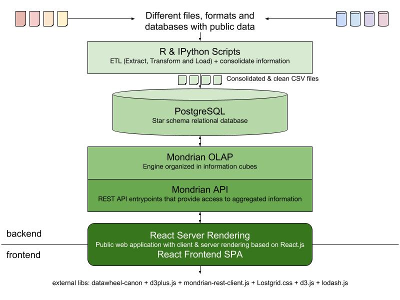

# DataChile Documentación general

## Stack tecnológico

El stack tecnológico de DataChile se resume en el siguiente esquema:

### 1. Datos: ETL + PostgreSQL

*   Se tomaron archivos con datos públicos desde distintos portales y pedidos de transparencia sobre varios tópicos relevantes.
*   La información fue limpiada, integrada y ordenada con R y convertidas a CSV.
*   Esos CSV son tratados e ingestados a la base de datos PostgreSQL.
*   La base de datos relacional PostgreSQL está organizada en forma de estrella y utiliza índices y claves para organizar la información.
*   Más detalles sobre este proceso en [Repositorio ETL para DataChile](https://github.com/Datawheel/datachile-etl)

### 2. API/Backend: Mondrian REST API

*   Contiene la configuración del esquema de cubos OLAP y dimensiones y provee el entrypoint REST de la API para consultas.
*   Se conecta a la base de datos PostgreSQL.
*   La implementación de la capa lógica usando [Mondrian REST](https://github.com/jazzido/mondrian-rest).
*   Más información sobre OLAP y su configuración en el [Repositorio API Mondrian para DataChile](https://github.com/Datawheel/datachile-mondrian)

### 3. Webapp: React-based application

*   La aplicación web fue construida sobre el framework Canon creado por DataWheel basado en [React.js](https://reactjs.org/).
*   La aplicación utiliza la API de Mondrian para nutrirse.
*   Allí se construyen y visualizan los perfiles, los datos y los gráficos.

## Documentación relacionada sobre Webapp

*   [Ambiente de desarrollo](development.md)
*   [Introducción a Canon](canon.md)
*   [Introducción a D3Plus-React en Canon](d3plus.md)
*   [Creación y mantención de Perfiles en DataChile](profiles.md)
*   [Creación y mantención de Gráficos en DataChile](charts.md)
*   [Deploy](deploy.md)
